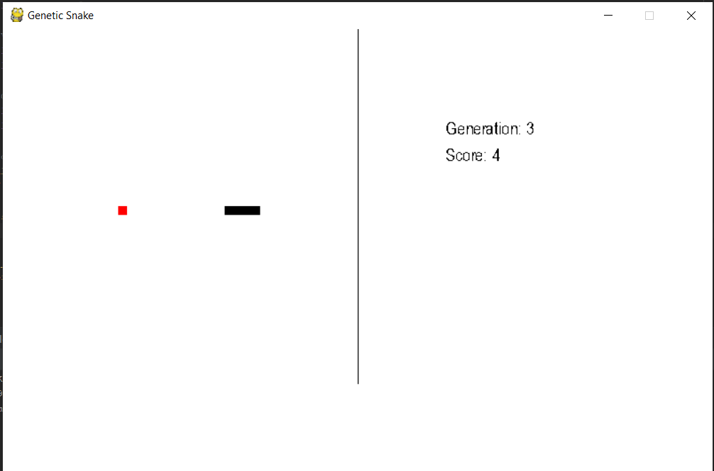
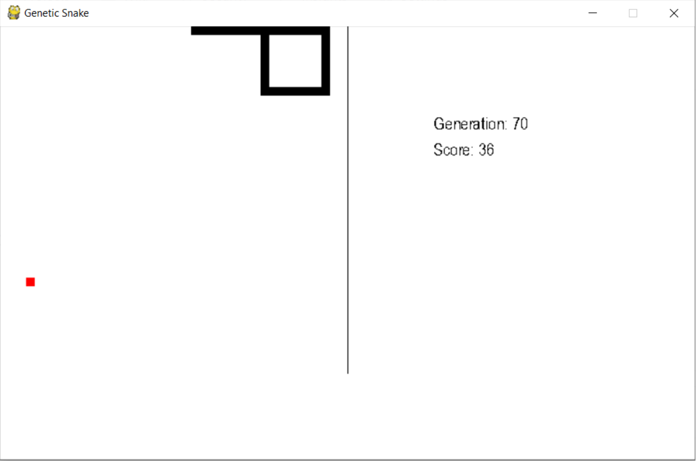

# GeneticAlgo-NN-Snake

## Introduction
This project is a self-teaching Snake game implemented using a genetic algorithm and a custom-built multi-layer neural network.

## Installation
1. Clone the repository.
2. Install the required dependencies using `pip install -r requirements.txt`.
3. Run the game using `python main.py`.

## Usage
- The game will automatically start and evolve the snake using genetic algorithms.
- The current generation and score are displayed on the screen.

## Concepts
- The neural network has 2 hidden layers with 18 nodes each, an input layer with 24 nodes, and an output layer with 4 nodes.
- The input layer consists of "visions" in 8 directions, each with parameters like distance from walls, presence of an apple, and distance from the tail.
- The genetic algorithm selects the best-performing snakes for the next generation, applying crossover and mutation.

## Strategy
- The snake's score is calculated based on its lifetime and tail length: `score = life_time^2 * 2^(tail_length)`.

## Contributing
Contributions are welcome! Please fork the repository and submit a pull request.

## License
This project is licensed under the MIT License.

# Game Screenshots
- Generation 3:

# Concepts
- NN's been made with 2 hidden layers (each 18 nodes), input layer's 24 nodes and the output one contains 4 nodes (each one is the snake's move direction) 
- Input layer is a set of "visions" in each 8 directions (left, up, right, down and diagonally ones)
- Each vision has parameters like distance from walls, is an apple on snake's way and distance from its tail
- The strategy of learning is to create as many snakes in one population as your processor is able to deal with and choose the best one (with the highest fitness score), 
place it into the next generation and crossover/mutate the other snakes as well
- The mutation process has been made with uniform strategy
- As said above, the NN has been created from scratch, therefore it was necessary to apply process of calculation a matrix dot product, applying activation (sigmoid) function etc.

# Strategy
As the snake's living time and his tail is getting longer, the snake's score is getting higher. Score is computed from formula: score = life_time ^ 2 * 2 ^ (tail_length)  
